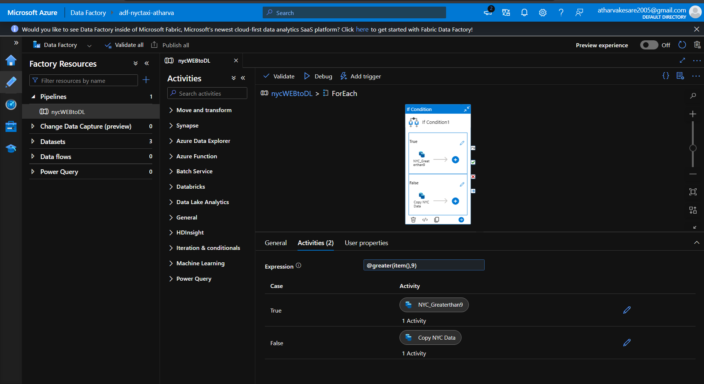
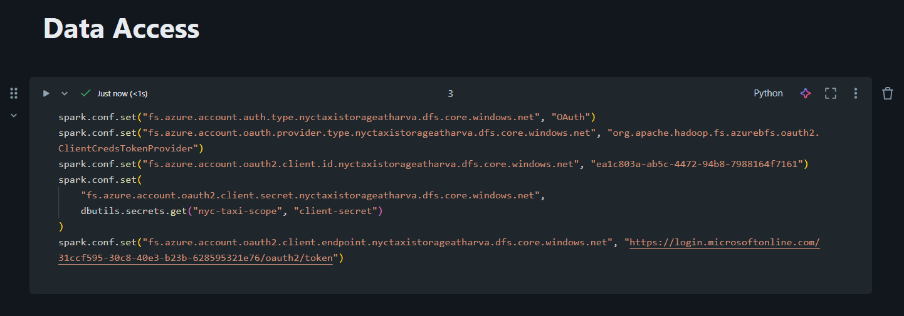

# NYC Taxi Data Engineering Project Overview

## **Project Purpose**  
This project builds an end-to-end data engineering pipeline to process and analyze NYC taxi trip data. The pipeline ingests raw trip data, cleans and transforms it, and produces summarized analytics for business insights.

## **Data Sources**  
- Trip zone and trip type lookup tables are stored as **CSV files** in Azure Data Lake Storage (ADLS).  
- Raw taxi trip records are stored as **Parquet files** in ADLS for efficient processing and storage.

## **Technology Stack**  
- **Azure Databricks:** Scalable Spark processing and Delta Lake management  
- **Delta Lake:** ACID transactions and versioning for Bronze, Silver, Gold layers  
- **Azure Data Lake Storage (ADLS):** Cloud storage for raw and processed datasets  
- **Databricks Secrets:** Secure credential management using secret scopes  
- **PySpark:** Data processing and transformations  
- **SQL:** Data analysis and table operations

## **Project Architecture**  
The pipeline implements a medallion architecture:  
- **Bronze Layer:** Raw data ingestion from Parquet and CSV files  
- **Silver Layer:** Data cleaning, validation, and enrichment with joins  
- **Gold Layer:** Business-ready aggregations and analytics tables

## Ingestion (Bronze Layer)

Designed dynamic ingestion pipelines in Azure Data Factory and/or Azure Databricks notebooks to extract NYC Taxi trip data across multiple months. 

Leveraged parameterized datasets and activities, enabling scalable and reusable ingestion that loads data continuously into the Bronze layer.

Raw data is ingested in Parquet format and stored securely in Azure Data Lake Storage Gen2, optimizing for performance and cost. The ingestion incorporates Databricks Unity Catalog to enforce centralized governance and secure access control.

## Silver Layer

Performed data cleaning, validation, and enrichment of the raw Bronze data. Applied transformations and joins using Azure Databricks notebooks and PySpark to produce refined datasets suitable for analysis. This layer ensures data quality and applies schema enforcement and evolution using Delta Lake features.

## Gold Layer

Created business-level aggregations and analytics tables optimized for reporting and visualization. Utilized SQL within Azure Databricks to generate summaries and key performance indicators (KPIs). This layer powers dashboards and BI tools, leveraging Delta Lake for ACID transactions and efficient querying.

## **Project Structure** 

yc-taxi-data-engineering/
├── notebooks/ # Databricks notebooks for Bronze, Silver, Gold processing
├── SQL/ # SQL scripts for analysis and table management
├── docs/ # Architecture diagrams, screenshots, and documentation
├── sample_data/ # Sample CSV files for testing
├── .gitignore # Git ignore file
└── README.md # This file

## **Security Implementation**  
- All sensitive credentials (client secrets, connection strings) are stored securely using **Databricks Secrets**  
- Authentication configured using Azure OAuth with service principal  
- No hardcoded secrets in notebooks or code  
- **Secret scope:** `nyc-taxi-scope` for secure credential management

## **How to Run**  
**Prerequisites:**  
- Azure Databricks workspace  
- Azure Data Lake Storage account  
- Service principal with appropriate permissions  

**Setup:**  
- Configure Databricks CLI and create secret scope  
- Store client secrets securely in Databricks Secrets  
- Update notebook configurations with your storage account details

**Execution Order:**  
- Run Bronze layer notebook for data ingestion  
- Execute Silver layer notebook for data transformations  
- Process Gold layer notebook for business aggregations  
- Use SQL scripts for additional analysis and table operations

## **Key Features Implemented**  
- Delta Lake Time Travel: Version control and data lineage  
- Data Quality Checks: Validation and error handling  
- Incremental Processing: Efficient data updates  
- Schema Evolution: Flexible data structure management  
- ACID Transactions: Data consistency and reliability

## **Known Limitations**  
- **Power BI/Tableau Integration:** Currently experiencing permission issues connecting to Delta tables from external BI tools. Additional configuration of access permissions and authentication methods is needed for external tool connectivity.

## **Sample Queries and Operations**  
Includes SQL operations like:  
- Data exploration and filtering  
- Table updates and deletes  
- Delta Lake history tracking  
- Table restoration and time travel

## **Future Enhancements**  
- Resolve external BI tool connectivity issues  
- Implement automated data quality monitoring  
- Add data pipeline orchestration with Azure Data Factory  
- Extend to real-time streaming data processing  
- Implement comprehensive logging and monitoring

## **Documentation**  
- Architecture diagrams and screenshots are available in `/docs`  
- Detailed project overview in `/docs/NYC Taxi Data Engineering Project O.txt`  
- SQL query examples in `/SQL` folder

## **Author**  
**Atharva Kesare** - First Data Engineering Project

**Note:** This project demonstrates practical implementation of modern data engineering 